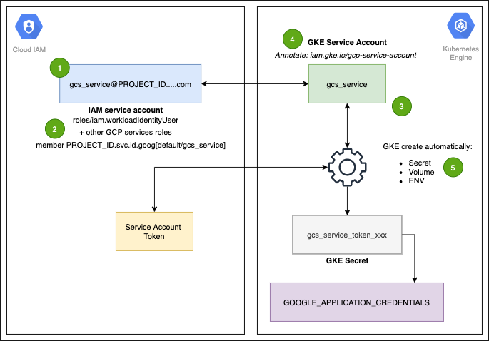

# This is not an official Google project.

This script is for educational purposes only, is not certified and is not recommended for production environments.

## Copyright 2021 Google LLC
Licensed under the Apache License, Version 2.0 (the "License"); you may not use this file except in compliance with the License. You may obtain a copy of the License at

  http://www.apache.org/licenses/LICENSE-2.0
Unless required by applicable law or agreed to in writing, software distributed under the License is distributed on an "AS IS" BASIS, WITHOUT WARRANTIES OR CONDITIONS OF ANY KIND, either express or implied. See the License for the specific language governing permissions and limitations under the License.

---


# Workload Identity Demo

This guide will help you to undestand how to implement Workload Identity with your Kubernetes cluster and how to set your deployment configuration to use a kubernetes service account linked to a IAM service account to perform operation with Google Cloud resources



### Steps to make Workload Identity works

+ 1) [Create a Cloud IAM service account](#setup-iam-and-kubernetes-sevice-accounts)
+ 2) [Add the iam.workloadIdentityUser role with the member value as $PROJECT_ID.svc.id.goog[$NAMESPACE/$SA_NAME]](#add-role-workloadidentityuser-to-iam-service-account)
+ 3) [Create a kubernetes service account](#setup-iam-and-kubernetes-sevice-accounts)
+ 4) [Create an annotation in the k8s service account with the reference to cloud IAM and to the service account](#create-an-annotation-in-the-k8s-service-account)
+ 5) GKE will automatically create a secret and inject 


## Set vars

```sh
export PROJECT_ID=$(gcloud config list --format 'value(core.project)')
```

## Create your cluster

To create your cluster attached to your project identity fleet you need to set the workload pool attribute with this flag.

```sh
--workload-pool=$PROJECT_ID.svc.id.goog
```

Create your private cluster with this command, note that this cluster will be attached to a workload pool.

```sh
gcloud beta container clusters create "k8s" \
--zone us-central1-a \
--enable-private-nodes \
--enable-ip-alias \
--master-ipv4-cidr "172.16.0.0/28" \
--workload-pool=$PROJECT_ID.svc.id.goog
```
If you inspect your cluster configurartion you will find the reference to the Workload Identity Pool

## Setup IAM and Kubernetes sevice accounts

First we need to create an IAM service account

```sh
export SA_NAME=gcs-service
export NAMESPACE=default
export MY_IP=$(curl ipinfo.io/ip)

gcloud iam service-accounts create $SA_NAME
```

Next we need to connect to the cluster and create a kubernetes service account

```sh
# connect to your cluster
gcloud container clusters get-credentials k8s --zone us-central1-a --project $PROJECT_ID

#Register your ip address as master authorized admin
gcloud container clusters update "k8s" \
    --enable-master-authorized-networks \
    --master-authorized-networks $MY_IP/32 \
    --zone us-central1-a

kubectl create serviceaccount --namespace $NAMESPACE $SA_NAME
```
### Create an annotation in the k8s service account

With the next command we will set a reference from the kubernetes service account to the IAM service account

```sh
kubectl annotate serviceaccount \
--namespace $NAMESPACE $SA_NAME \
iam.gke.io/gcp-service-account=$SA_NAME@$PROJECT_ID.iam.gserviceaccount.com
```

### Add role workloadIdentityUser to IAM Service Account

finaly we neewd to add the **workloadIdentityUser** role to the IAM service account and set the memeber attribute with the workload pool name and the Namespace and Kubernetes Service Account name reference

```sh
gcloud iam service-accounts add-iam-policy-binding \
$SA_NAME@$PROJECT_ID.iam.gserviceaccount.com \
--role roles/iam.workloadIdentityUser \
--member "serviceAccount:$PROJECT_ID.svc.id.goog[$NAMESPACE/$SA_NAME]"
```

## Reference Service Account in Deployment

To test the workload identity configuration you could clone this git project and follow the next steps

```sh
git clone https://github.com/develasquez/workload-identity-gke.git

cd workload-identity-gke
```

To reference the service account to your Pod you must to add the next value in the deployment yaml file

```yaml
    spec:
      serviceAccountName: gcs-service
```
To test this application we need to create a bucket and a file inside.

```sh
gsutil mb gs://$PROJECT_ID-bucket;
echo "Reading files thanks to Workload Identity on $PROJECT_ID" > data.txt;
gsutil cp data.txt gs://$PROJECT_ID-bucket;
```


You cloud deploy this application to your cluster run the follow command

```sh
./deploy.sh $PROJECT_ID $RANDOM $SA_NAME
```

Until your app was deployed you coud test it with a curl using the LoadBalancer Ingress IP

```sh
kubectl describe service lb
curl http://<LoadBalancerIP>
```
As you can see, your pod doen't have access to your bucket, because we need to add the right permisions to the service account in IAM

```sh
gcloud projects add-iam-policy-binding $PROJECT_ID \
--member serviceAccount:$SA_NAME@$PROJECT_ID.iam.gserviceaccount.com \
--role roles/storage.objectViewer
```

Wait few minutes and test your app again

```sh
curl http://<LoadBalancerIP>
```
